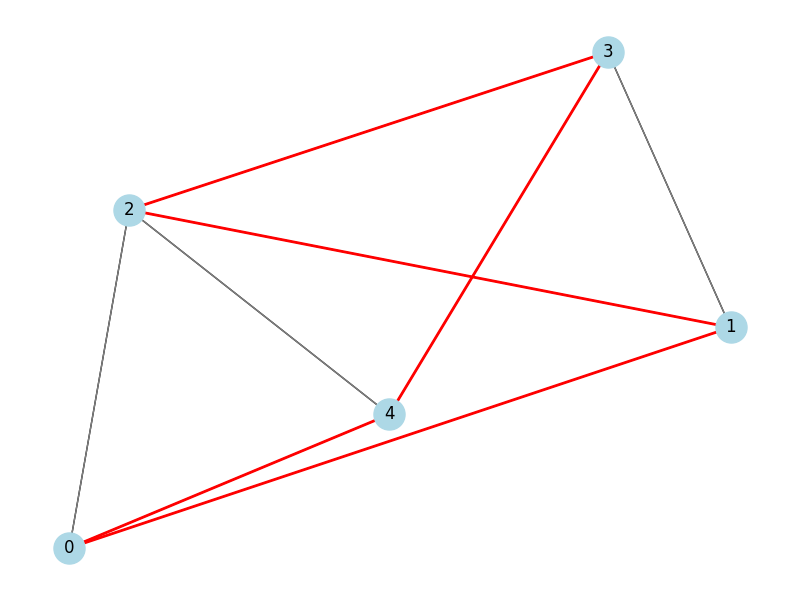

# Implementação do Ciclo Hamiltoniano

## Descrição do Projeto

Este projeto implementa um algoritmo para encontrar um **Ciclo Hamiltoniano** em um grafo utilizando Python. Um Ciclo Hamiltoniano é um caminho que visita cada vértice de um grafo exatamente uma vez e retorna ao vértice inicial, formando um ciclo fechado. A implementação utiliza uma abordagem de **backtracking** para explorar sistematicamente todos os caminhos possíveis até encontrar um ciclo válido ou determinar que ele não existe.

### Lógica do Algoritmo (Explicação Linha a Linha)

A implementação está no arquivo `main.py`. Abaixo, segue uma explicação detalhada de cada componente do código:

- **Classe `Graph` (`__init__`)**:
  - Inicializa o grafo com `V` vértices usando uma matriz de adjacência (`self.graph`).
  - A matriz é uma lista `V x V`, onde `graph[i][j] = 1` indica uma aresta de `i` para `j`.

- **Método `add_edge(u, v, directed=False)`**:
  - Adiciona uma aresta entre os vértices `u` e `v`.
  - Se `directed=False`, adiciona também a aresta inversa (`v` para `u`), para grafos não direcionados.

- **Método `is_safe(v, pos, path)`**:
  - Verifica se o vértice `v` pode ser adicionado na posição `pos` do caminho.
  - Confirma se `v` é adjacente ao vértice anterior (`path[pos-1]`) e se não está presente no caminho.

- **Método `hamiltonian_cycle_util(path, pos)`**:
  - Função recursiva que constrói o Ciclo Hamiltoniano.
  - **Caso Base**: Quando `pos == V`, verifica se existe uma aresta do último vértice para o primeiro, fechando o ciclo.
  - **Passo Recursivo**: Para cada vértice `v`, verifica se é seguro adicioná-lo na posição `pos`. Se sim, inclui `v` e chama a função para `pos+1`.
  - **Backtracking**: Se o caminho atual não leva a uma solução, reseta `path[pos]` e tenta outro vértice.

- **Método `find_hamiltonian_cycle()`**:
  - Inicializa o caminho com o vértice 0 na primeira posição e chama `hamiltonian_cycle_util` para preencher o restante.
  - Retorna o caminho se um ciclo for encontrado ou imprime "Nenhum Ciclo Hamiltoniano existe" caso contrário.

- **Bloco Principal (`if __name__ == "__main__"`)`:
  - Cria um grafo de exemplo com 5 vértices e adiciona arestas predefinidas.
  - Executa `find_hamiltonian_cycle` para testar o algoritmo.

Para a visualização opcional, o arquivo `view.py` utiliza as bibliotecas **NetworkX** e **Matplotlib** para desenhar o grafo e destacar o Ciclo Hamiltoniano, se encontrado, em vermelho.

## Como Executar o Projeto

### Pré-requisitos
- Python 3.8 ou superior.
- Para a visualização (opcional), instale as dependências:
  ```bash
  pip install networkx matplotlib
  ```

### Passos para Executar
1. Clone o repositório:
   ```bash
   git clone https://github.com/<seu-usuario>/HamiltonianCyclePython.git
   cd HamiltonianCyclePython
   ```

2. Execute o programa principal:
   ```bash
   python main.py
   ```
   Isso executa o algoritmo em um grafo de exemplo e imprime o Ciclo Hamiltoniano, se encontrado.

3. (Opcional) Execute a visualização:
   ```bash
   python view.py
   ```
   Isso gera uma visualização do grafo, salva como `assets/hamiltonian_cycle.png`.

### Saída Esperada
- **main.py**: Imprime o Ciclo Hamiltoniano (exemplo: `[0, 1, 2, 3, 4, 0]`) ou a mensagem "Nenhum Ciclo Hamiltoniano existe".
- **view.py**: Exibe o grafo com:
  - Nós rotulados (0 a V-1).
  - Arestas do grafo em cinza.
  - Arestas do Ciclo Hamiltoniano (se encontrado) em vermelho.
  - Salva a imagem em `assets/hamiltonian_cycle.png`.

## Relatório Técnico

### 1. Análise da Classe de Complexidade

#### Classes P, NP, NP-Completo e NP-Difícil
- **Classificação**: O problema do Ciclo Hamiltoniano é **NP-Completo**.
- **Explicação**:
  - **NP**: Uma solução proposta (um ciclo) pode ser verificada em tempo polinomial, checando se visita todos os vértices exatamente uma vez e forma um ciclo (complexidade O(V)).
  - **NP-Completo**: O problema está em NP e é redutível a partir de outros problemas NP-Completos, como o Vertex Cover. Ele está entre os problemas mais difíceis da classe NP.
  - **Relação com o Problema do Caixeiro Viajante (TSP)**: O Ciclo Hamiltoniano é um caso especial do TSP, onde os pesos das arestas são irrelevantes, e apenas a existência de um ciclo importa. Como o TSP (versão de decisão) é NP-Completo, o Ciclo Hamiltoniano também o é.
- **Não NP-Difícil**: O problema não é classificado como NP-Difícil, pois está contido em NP (é NP-Completo, não mais difícil que NP).

#### Justificativa
- A NP-Completude é confirmada pela verificabilidade em tempo polinomial e pela possibilidade de reduzir problemas como SAT ou Vertex Cover ao Ciclo Hamiltoniano (ver [AULA 02_Introdução à teoria da complexidade.pdf]).
- Diferentemente dos problemas em P, que possuem algoritmos polinomiais, o Ciclo Hamiltoniano não tem solução eficiente conhecida para grafos gerais.

### 2. Análise da Complexidade Assintótica de Tempo

#### Complexidade
- **Complexidade de Tempo**: O(V!) no pior caso, onde `V` é o número de vértices.
- **Determinação**:
  - O algoritmo de backtracking explora todas as permutações possíveis dos vértices para encontrar um ciclo válido.
  - Para cada posição `pos` (de 1 a `V`), até `V` vértices são testados, gerando até `V!` combinações.
  - A função `is_safe` realiza verificações em O(V) (adjacência e presença no caminho).
  - A complexidade total é O(V * V!) ≈ O(V!), pois o termo fatorial domina.

#### Método Utilizado
- **Contagem de Operações**: A árvore de recursão tem até `V!` nós folha, correspondendo às permutações dos vértices. Cada nó realiza O(V) operações para verificar a segurança.
- Não foi usada uma recorrência explícita, pois o backtracking gera uma complexidade combinatória.

### 3. Aplicação do Teorema Mestre

#### Aplicabilidade
- O Teorema Mestre **não é aplicável** a este algoritmo.
- **Motivo**: O algoritmo não segue o paradigma de divisão e conquista, que requer uma relação de recorrência na forma `T(n) = aT(n/b) + f(n)`.
- **Justificativa**: O backtracking cria uma árvore recursiva onde cada chamada ramifica com base nos vértices válidos disponíveis, não em subproblemas de tamanho fixo. A complexidade resulta da exploração exaustiva de permutações.

### 4. Análise dos Casos de Complexidade

#### Casos
- **Pior Caso**: O(V!)
  - Ocorre quando o algoritmo explora todas as permutações possíveis, como em grafos sem Ciclo Hamiltoniano ou quando o ciclo é encontrado após testar quase todos os caminhos.
  - Exemplo: Um grafo sem ciclo exige verificar todas as `V!` permutações.
- **Caso Médio**: Aproximadamente O(V!) para grafos aleatórios.
  - Depende da estrutura do grafo. Grafos densos podem encontrar um ciclo mais rápido, mas grafos esparsos tendem a exigir exploração completa.
- **Melhor Caso**: O(V)
  - Ocorre quando o ciclo é encontrado na primeira tentativa, como em grafos altamente estruturados (ex.: grafo completo onde o primeiro caminho é válido).
  - É raro na prática.

#### Impacto no Desempenho
- **Pior Caso**: Torna o algoritmo inviável para grafos grandes (`V > 20`) devido ao crescimento fatorial.
- **Caso Médio**: Ainda caro computacionalmente, pois a maioria dos grafos requer exploração significativa.
- **Melhor Caso**: Ideal, mas improvável em cenários gerais.
- Grafos densos tendem a ter melhor desempenho, pois oferecem mais opções válidas, enquanto grafos esparsos aumentam a probabilidade de backtracking.

## Visualização (Opcional)

### Instruções
- Instale as dependências necessárias:
  ```bash
  pip install networkx matplotlib
  ```
- Execute o script de visualização:
  ```bash
  python view.py
  ```
- **Saída**:
  - Exibe o grafo com nós rotulados (0 a V-1).
  - Arestas do grafo em cinza.
  - Arestas do Ciclo Hamiltoniano (se encontrado) em vermelho.
  - Salva a imagem como `assets/hamiltonian_cycle.png`.

### Exemplo


## Estrutura do Repositório
```
├── main.py              # Implementação do algoritmo principal
├── view.py              # Script para visualização (opcional)
├── README.md            # Documentação do projeto
├── assets/
│   └── hamiltonian_cycle.png  # Imagem gerada pela visualização
```

## Referências
- AULA 02_Introdução à teoria da complexidade.pdf
- [Fundamentos de Projeto e Análise de Algoritmos](https://github.com/joaopauloaramuni/fundamentos-de-projeto-e-analise-de-algoritmos)
